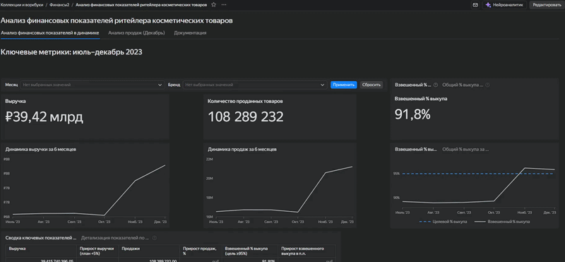
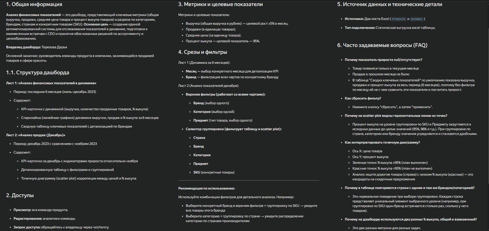

# Анализ финансовых показателей ритейлера косметических товаров


Интерактивный дашборд для отслеживания ключевых метрик продаж, анализа эффективности ассортимента и подготовки к ежемесячным встречам с CEO.

---
## Как посмотреть дашборд

### Вариант 1: Интерактивная версия в Yandex DataLens

Перейдите по ссылке: [Интерактивный дашборд](https://datalens.yandex/arjd82hol5c0u)

Для просмотра дашборда необходим аккаунт в Яндексе.

Если у вас нет аккаунта, вы можете:
- Зарегистрироваться на [yandex.ru](https://yandex.ru)

### Вариант 2: Скриншоты и гифки

Если у вас нет аккаунта в Яндексе, вы можете ознакомиться со скриншотами дашборда в папках:
- `screenshots/` — статичные скриншоты
- `gifs/` — анимации работы дашборда

## Дашборд

### Лист 1: Анализ финансовых показателей в динамике
Анализ ключевых метрик за 6 месяцев (июль–декабрь 2023)



- KPI-карточки с MoM-приростом (выручка, продажи, средняя цена, % выкупа)
- Спарклайны динамики за 6 месяцев
- Таблица со сводкой ключевых показателей
- Таблица с детализацией по брендам

### Лист 2: Анализ продаж (Декабрь)
Детальный анализ последнего отчетного периода


- KPI-карточки за декабрь с приростом к ноябрю
- Интерактивная таблица с 5 уровнями группировки (Страна → Категория → Бренд → Предмет → SKU)
- Scatter plot: корреляция цены и взвешенного % выкупа

### Лист 3: Документация
Справочная информация по дашборду: назначение, метрики, фильтры, FAQ



---

## Задача

Создать единый дашборд для косметического ритейлера, который позволит:
- Отслеживать выполнение плана по выручке (≥5% MoM) и % выкупа (≥95%)
- Выявлять проблемные бренды и категории
- Принимать решения по оптимизации ассортимента
- Автоматизировать подготовку отчетности для CEO

**Ключевые метрики:** выручка, продажи, средняя цена товара, взвешенный % выкупа.

---

## Технологии и данные

| Параметр | Значение |
|:---|:---|
| BI-инструмент | Yandex DataLens |
| Источники данных | Excel (2 таблицы: Products, Dynamic) |
| Период данных | Июль–Декабрь 2023 |
| Объём данных | ~90 000 SKU, ~1000 брендов |

---

## Методология

### Взвешенный % выкупа (основная метрика)
Ключевая метрика для оценки качества сервиса. Учитывает объём продаж каждого товара:

```
Взвешенный % выкупа = Σ(Продажи × % выкупа) / Σ(Продажи)
```

В отличие от среднего арифметического, взвешенный показатель учитывает реальный вклад каждого товара: товар с 1000 продажами и выкупом 95% влияет на бизнес сильнее, чем товар с 1 продажей и выкупом 50%.

### Общий % выкупа (дополнительная метрика)
Среднее арифметическое процента выкупа всех товаров в срезе:

```
Общий % выкупа = AVG(% выкупа всех товаров)
```

Используется для выявления проблемных нишевых товаров с низким выкупом.

### Прирост MoM (Month-over-Month)
```
Прирост = (Текущий месяц − Предыдущий месяц) / Предыдущий месяц
```

Все формулы содержат защиту от деления на ноль через `IFNULL()`.

### Средняя цена товара
На уровне датасета Products (для KPI-карточки):
```
Средняя цена = AVG([Цена (Декабрь)])
```
Простое среднее арифметическое цен всех товаров в срезе. Показывает, по какой цене в среднем представлены товары в ассортименте.

Прирост средней цены:
```
Прирост = (AVG(Цена Декабрь) − AVG(Цена Ноябрь)) / AVG(Цена Ноябрь)
```

### Средний чек
На уровне датасета Dynamic (для таблицы  Детализация по брендам):
```
Средний чек = SUM([Выручка]) / SUM([Продажи])
```
Взвешенная средняя цена, учитывающая объемы продаж. Показывает реальную цену, которую платит покупатель.

Мы используем две метрики так как:
- **Средняя цена** (AVG) отвечает на вопрос: "По какой цене в среднем выставлены товары?"
- **Средний чек** (SUM/SUM) отвечает на вопрос: "По какой цене в среднем покупают товары?"

Если товары по ₽100 продаются массово, а товары по ₽5000 — единично, средний чек будет ближе к ₽100, хотя средняя цена может быть ~₽2500.

---

## Архитектурные решения

### Разделение логики между датасетом и чартами
- **Датасет** содержит только бизнес-логику: расчет приростов, взвешенных метрик, защиту от деления на ноль
- **Чарты** отвечают только за визуализацию: форматирование чисел, цвета

Преимущества такого подхода:
- Согласованность данных: все чарты используют одинаковые формулы расчета метрик
- Удобство внесения изменений: изменение формулы в одном месте автоматически применяется во всех чартах
- Читаемость: формулы в чартах короче и понятнее, так как не содержат сложных вычислений

### Динамическая группировка через параметр
Одна таблица с 5 уровнями группировки (Страна → Категория → Бренд → Предмет → SKU) реализована через параметр `analysis_type` и вычисляемое поле [Анализ по срезам]:

```
IF [analysis_type] = 'Бренд' THEN [Бренд]
ELSEIF [analysis_type] = 'Страна' THEN [Страна]
ELSEIF [analysis_type] = 'Категория' THEN [Категория]
ELSEIF [analysis_type] = 'Предмет' THEN [Предмет]
ELSEIF [analysis_type] = 'SKU' THEN
      [Бренд] + " | " + [Предмет] + " | " + STR([SKU])
ELSE [Категория]
END
```
### Кастомная разметка KPI-карточек
Использование функций `COLOR`, `SIZE`, `BR` для создания карточек с:
- Цветовой индикацией прироста (зеленый/красный/серый)
- Автоматическим форматированием чисел (трлн/млрд/млн/тыс)
- Фиксированной высотой блоков (предотвращает «скачки» при смене фильтров)

---

## Ключевые инсайты

### Декабрь 2023
- **Выручка выросла на 7.39%** относительно ноября (план 5% выполнен)
- **Взвешенный % выкупа составил ~96%** (план 95% выполнен)
- **Выявлены 3 бренда с падением выручки >10%** (требуют маркетинговых мер)
- **Продажи выросли на 3.05%** месяц к месяцу

### Динамика за 6 месяцев
- Стабильный рост выручки с октября 2023
- Взвешенный % выкупа превысил плановый показатель в ноябре и декабре

---

## Бизнес-ценность

**Для кого предназначен дашборд:**
- **CEO и топ-менеджмент:** стратегические метрики в одном окне
- **Продукт-менеджеры:** анализ эффективности брендов и категорий
- **Бренд-менеджеры:** контроль показателей по конкретным брендам
- **Аналитики:** детальный анализ с 5 уровнями группировки
- **Маркетологи:** планирование акций на основе данных о выкупе

Какие задачи решает:
Отслеживание выполнения плана по выручке (≥5% MoM) и % выкупа (≥95%)
Выявление проблемных брендов и категорий
Анализ зависимости % выкупа от цены товара
Принятие решений по оптимизации ассортимента
Автоматизация подготовки отчетности

---

## Структура проекта

```

├── README.md
├── screenshots/				# Статичные скриншоты
│   ├── sheet1_overview.png
│   ├── sheet1_overview_with_filters.png
│   ├── sheet1_overview_with_filters2.png
│   ├── sheet2_detailed_analysis1.png
│   ├── sheet2_detailed_analysis2.png
│   ├── sheet2_detailed_analysis_with_filters.png
│   ├── scatter_plot_correlation.png
│   └── sheet3_documentation.png
├── gifs/					 # Демонстрация работы дашборда
│   ├──  sheet1_overview_anim.gif
│   └── sheet2_detailed_analysis_anim.gif
├── docs/
│   └── fields_reference.md			# Полный справочник полей
├── data/					# Исходные данные
│    └── dynamic_products.xlsx
└──.gitignore
```
